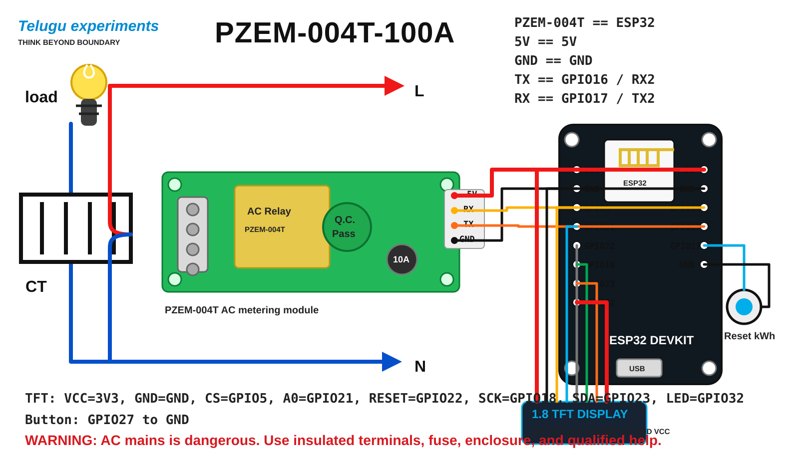

# ESP32 PZEM-004T Power Meter

Arduino sketch for an ESP32 power meter using a Peacefair PZEM-004T AC energy meter and a 1.8 inch SPI TFT display.



## Libraries

Install these from Arduino IDE Library Manager:

- `PZEM004Tv30`
- `Adafruit GFX Library`
- `Adafruit ST7735 and ST7789 Library`

Use an ESP32 board package in Arduino IDE.

## Wiring

### TFT display

| TFT pin | ESP32 pin |
| --- | --- |
| LED | GPIO32 |
| SCK | GPIO18 |
| SDA | GPIO23 |
| A0 | GPIO21 |
| RESET | GPIO22 |
| CS | GPIO5 |
| GND | GND |
| VCC | 3.3V |

If your TFT module specifically supports 5V VCC, 5V can be used for VCC, but the logic pins should remain 3.3V for ESP32 safety.

### PZEM-004T

| PZEM pin | ESP32 pin |
| --- | --- |
| TX | GPIO16 / RX2 |
| RX | GPIO17 / TX2 |
| GND | GND |
| VCC | 5V or as required by your PZEM module |

Connect the AC side exactly according to the PZEM-004T module diagram. Mains AC can kill you or start a fire, so use an enclosure, fuse, insulated terminals, and get help from a qualified electrician if you are not experienced with AC wiring.

### Reset button

| Button side | Connection |
| --- | --- |
| One side | GPIO27 |
| Other side | GND |

Press the button to reset the kWh energy count. You can also reset from the mobile web page.

## Mobile web page

By default the ESP32 creates a WiFi access point:

- SSID: `ESP32-Power-Meter`
- Password: `12345678`
- Web page: `http://192.168.4.1`

This mode does not need an external internet connection. Your phone connects directly to the ESP32 WiFi network and reads the live voltage, current, watts, kWh units, frequency, and power factor from the ESP32 web server.

To connect to your home WiFi instead, edit these lines in `PowerMeterESP32.ino`:

```cpp
const char *WIFI_SSID = "";
const char *WIFI_PASS = "";
```

If you leave the WiFi fields empty, use the default access point address: `http://192.168.4.1`.
